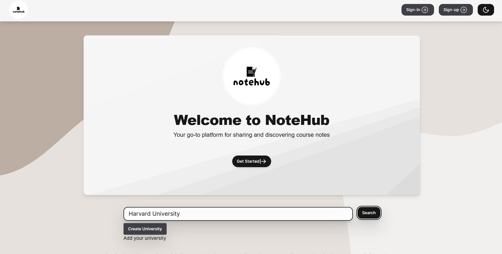

# NoteHub

## Overview

**NoteHub** is a scalable note-sharing web application designed to enable university students to find classes and securely share notes. The application uses a robust technology stack to ensure performance, security, and a seamless user experience.



### Key Features

- **Scalable Architecture**: Built with TypeScript and React for the frontend, and Node.js with Azure Functions and Tables for the backend.
- **Secure Authentication**: Implements JWT-based authentication and session management with cookies, ensuring secure and persistent login states.
- **Optimized Performance**: Leverages Azure's serverless architecture for high availability, performance, and cost-effectiveness.
- **User-Friendly Interface**: Intuitive and responsive design that facilitates easy access to notes and collaboration among students.

## Technology Stack

- **Frontend**: TypeScript, React
- **Backend**: Node.js, Azure Functions, Azure Tables
- **Authentication**: JWT, Cookies
- **Deployment**: Azure (Serverless Architecture)

## Installation & Setup

### Prerequisites

Before setting up the project, ensure you have the following installed:

- Node.js (v14.x or higher)
- npm or yarn
- Azure account

### Frontend Setup

1. **Clone the repository**:
    ```bash
    git clone https://github.com/your-username/notehub.git
    cd notehub/frontend
    ```

2. **Install dependencies**:
    ```bash
    npm install
    # or
    yarn install
    ```

3. **Run the development server**:
    ```bash
    npm start
    # or
    yarn start
    ```

4. **Build for production**:
    ```bash
    npm run build
    # or
    yarn build
    ```

### Backend Setup

1. **Navigate to the backend directory**:
    ```bash
    cd ../backend
    ```

2. **Install dependencies**:
    ```bash
    npm install
    # or
    yarn install
    ```

3. **Setup environment variables**:
   Create a `.env` file and add your Azure credentials, JWT secret, and other necessary environment variables:
   ```bash
   AZURE_STORAGE_ACCOUNT=<Your Azure Storage Account>
   AZURE_STORAGE_ACCESS_KEY=<Your Azure Storage Access Key>
   JWT_SECRET=<Your JWT Secret>

4. **Deploy to Azure Functions**
  Ensure that you have the Azure Functions Core Tools installed.
  Run the following command to deploy:

  ```bash
  func azure functionapp publish <Your Function App Name>
  ```


**Authentication**  
Users must sign up or log in using their university email to access the platform.  
JWT tokens are used for authentication and stored in secure, HTTP-only cookies.

**Note Sharing**  
Users can search for classes, upload notes, and share them with other students in the same class.  
Notes are stored securely in Azure Tables and can be accessed by authorized users only.

## Contributing  
Contributions are welcome! Please follow the guidelines below:

  
- Fork the repository.
- Create a new branch: `git checkout -b feature-branch-name`.
- Make your changes and commit: `git commit -m 'Add some feature'`.
- Push to the branch: `git push origin feature-branch-name`.
- Submit a pull request.


 Sadly our Azure credits ran out, so our backend does not work
